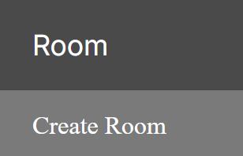
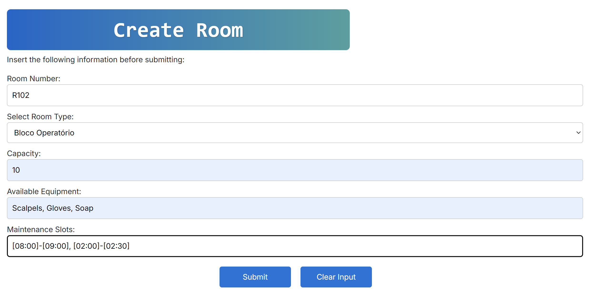

# US 7.2.17

<!-- TOC -->
- [US 7.2.17](#us-7.2.17)
  - [1. Context](#1-context)
  - [2. Requirements](#2-requirements)
  - [3. Analysis](#3-analysis)
    - [3.1 System Sequence Diagram](#31-system-sequence-diagram)
    - [3.2 Domain Model](#32-domain-model)
  - [4. Design](#4-design)
    - [4.1. Realization](#41-realization)
    - [4.2. Class Diagram](#42-class-diagram)
    - [4.3. Applied Patterns](#43-applied-patterns)
    - [4.4. Tests](#44-tests)
  - [5. Implementation](#5-implementation)
  - [6. Integration/Demonstration](#6-integrationdemonstration)
  - [7. Observations](#7-observations)
<!-- TOC -->

## 1. Context

This is the first time this US is being worked on.
It relates to the Admin.

## 2. Requirements

**US 7.2.17:** As an Admin, I want to create a room.

**Acceptance Criteria:**

**US 7.2.17.1:** The functionality must have a Angular UI to comply with the specifications of the US 7.1.1.

**US 7.2.17.2:** The functionality must have an implementation on the .NET server in oder to function correctly.

**US 7.2.17.3:** The functionality must be related to the patient's medical record as it needs to eventually add the searched allergy to the referred document.

**US 7.2.17.4:** The functionality must have a way to cancel the search when the doctor changes their mind, effectively dividing this US's functionality into 2, searching and then possibly adding.

**US 7.2.17.5:** The functionality must implement a rudimentary search system to show the allergies that can be added.

**US 7.2.17.6:** The functionality must not show the already added allergies OR inform the user they already have been added.

**Dependencies/References:**

**US 7.1.#:** Is dependent on all these US as they pertain to integrating different modules of the system.

**Client Clarifications:**

None.

## 3. Analysis

The admin must input the following attributes to create a room:

- **Room Code**: A unique identifier in the format R<3 digit number>. Example: R001, R256.
- **Type of Room**: A string that describes the type of room (e.g., "Operating Room", "ICU").
- **Equipment**: A comma-separated list of equipment (e.g., "Bed, Ventilator, Monitor").
- **Maintenance Slots**: A comma-separated list of time slots in the format [HH:MM]-[HH:MM]. Example: [09:00]-[10:30], [14:00]-[15:00].
- **Capacity**: An integer representing the maximum number of patients or occupants the room can hold.

The system must validate the input format for each attribute:

- **Room Code**: Must match the regex ^R\d{3}$.
- **Equipment**: Must be a comma-separated string of non-empty values.
- **Maintenance Slots**: Each slot must match the regex ^\[\d{2}:\d{2}\]-\[\d{2}:\d{2}\]$.
- **Capacity**: Must be a positive integer.

Upon successful creation, the room data must be stored in the database.

If any attribute fails validation, the system must display an error message specifying the invalid field.

## 4. Design

#### Views

The logical, physical, development and scenario views diagrams are generic for all the use cases of the backoffice component.
These diagrams can be found in the [generic views diagrams compilation file](../../team-decisions/views/general-views.md).

The process view levels are here represented as they represent a process specific to each user story.

##### Process View

The level 1 and 2 of this view was considered not to add more information in addition to the SSD shown above.
However level 3 is shown below.

###### Process View - Level 1

###### Process View - Level 2

###### Process View - Level 3

### 4.2. Domain Model Excerpt

### 4.3. Applied Patterns

> #### **Repository Pattern**
>
>* **Components:** RoomRepository
>
> The repositories handle data access and retrieval, isolating the database interaction logic from services and other
> layers. This approach abstracts the persistence logic, promoting separation of concerns.

> #### **DTO (Data Transfer Object) Pattern**
>
>* **Components:** RoomListDTO
>
> DTOs are utilized to transfer data between layers, particularly from the controller layer to the service layer and
> vice versa. Their main purpose is to convey data in a structured and decoupled manner without revealing the internal
> representations of entities. Additionally, this pattern is not required to adhere to business rules.

> #### **Facade Pattern**
>
>* **Components:** RoomService
>
> These services function as a facade, simplifying the interaction with lower-level components such as repositories.
> The controller communicates with these service facades, concealing the complexity from the upper layers.

## 5. Implementation

The implementation followed the design.

To fully experience the implementation, the user must first login with an admin account since it's the only role allowed to do such a request:

After doing so, the user must choose the Allergy segment of the sidebar and choose "List Allergies":

After that, the admin will be presented with imputs that they will need to fill:

## 6. Testing

//TO BE DONE