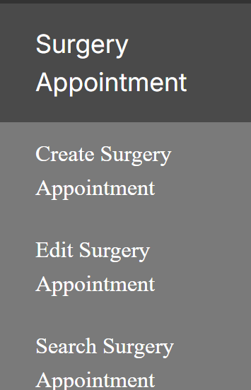
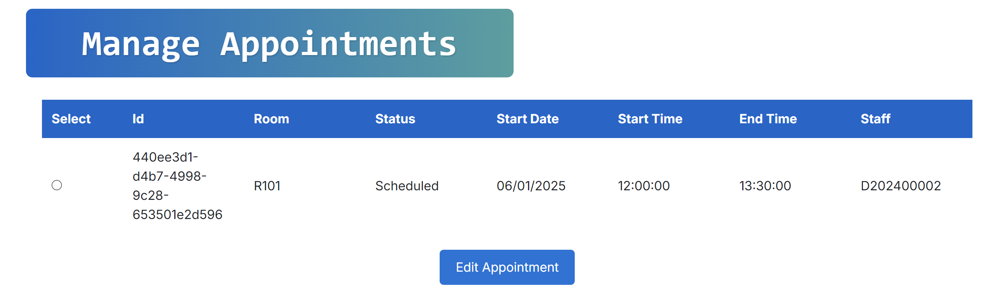
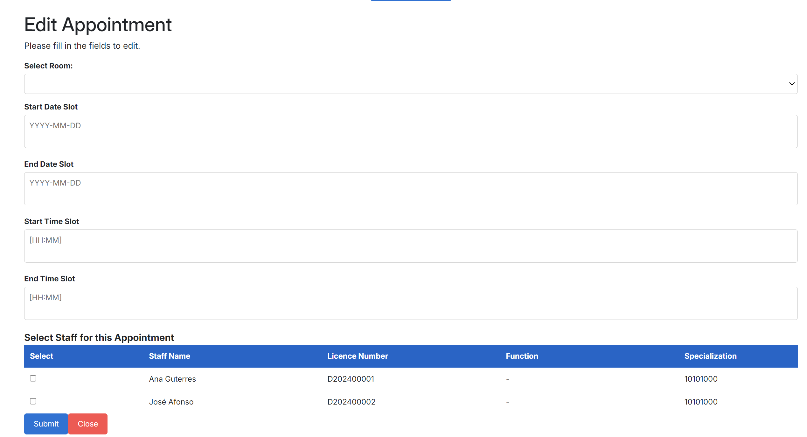

# US 7.2.9

<!-- TOC -->
- [US 7.2.9](#us-7.2.9)
  - [1. Context](#1-context)
  - [2. Requirements](#2-requirements)
  - [3. Analysis](#3-analysis)
    - [3.1 System Sequence Diagram](#31-system-sequence-diagram)
    - [3.2 Domain Model](#32-domain-model)
  - [4. Design](#4-design)
    - [4.1. Realization](#41-realization)
    - [4.2. Class Diagram](#42-class-diagram)
    - [4.3. Applied Patterns](#43-applied-patterns)
    - [4.4. Tests](#44-tests)
  - [5. Implementation](#5-implementation)
  - [6. Integration/Demonstration](#6-integrationdemonstration)
  - [7. Observations](#7-observations)
<!-- TOC -->

## 1. Context

This is the first time this US is being worked on.
It relates to the Doctor.

## 2. Requirements

**US 7.2.9:** As a Doctor, I want to update a Surgery Appointment, so that I can override the automatically generated planning.

**Acceptance Criteria:**

**US 7.2.9.1:** The functionality must have a Angular UI to comply with the specifications of the US 7.1.1.

**US 7.2.9.2:** The functionality must have an implementation on the .NET server in oder to function correctly.

**US 7.2.9.3:** The functionality implies that the generated surgery appointment from the planning system can be edited.

**US 7.2.9.4:** The functionality must edit the surgery appointment and then inform the user of it's success/failure.

**US 7.2.9.5:** After the appointment is planned, it is possible to update the team, room, date and time. 

**US 7.2.9.6:** The system must ensure all the resources and personnel is available at the selected time according to the operation type duration.

**US 7.2.9.7:** The team must include the whole team that conforms to the team composition according to the operation type specification.

**Dependencies/References:**

**US 7.2.5:** Is dependent on this US because it will have the list of medical conditions that can be added.

**US 7.2.8:** Is somewhat dependent on this US since it creates surgery appointments and they can be edited through this US.

**US 7.2.10:** Is somewhat dependent on this US since it creates rooms that will be used when editing a surgery appointment.

**US 7.2.11:** Is somewhat dependent on this US since it creates specialities for the staff that will be used when editing a surgery appointment.

**Client Clarifications:**

>**Question:** Should the doctor be able to make a surgery appointment without making a prior operation request for said appointment?
>
>**Answer:** The doctor must be able to "transform" an existing operation request into an actual appointment by specifying the room, date and team of the surgery. the system must ensure all the resources and personnel is available at the selected time according to the operation type duration.
>
> After the appointment is planned, it is possible to update the team, room and date. the system must ensure all the resources and personnel is available at the selected time according to the operation type duration.

>**Question:** According to a previous answer about this requirement, when the doctor attempts the creation of an appointment, they specify room, date and team. But do they also specify the time in which the surgery should start?
>
>**Answer:** Yes.

>**Question:** Regarding the team selected by the doctor when creating the appointment, does this team include only doctors, doctors and anesthetists, or doctors, anesthetists and cleaners?
>
>**Answer:** It must include the whole team that conforms to the team composition according to the operation type specification.

>**Question:** When the doctor selects the team for the Appointment, that includes doctors and nurses. Regarding cleaners, which staff (doctors, nurses, interns) can be selected for that role? And is there any criteria for that selection?
>
>**Answer:** The doctor only selects the medical team.

## 3. Analysis

This User Story asks to implement: 

1. The back-end implementation of a request that returns a list of all surgery appointments that haven't happened yet.

2. The back-end implementation of a request that will take the id of a surgery appointment, the updated team or null, the updated room or null, the updated date or null and the updated time or null. 

3. To implement the front-end part of this US, in order to comply with the US's 7.2.4.1 acceptance criteria.  

This User Story will follow the same system as previous USs with the objective to list and edit certain objects from the database.

## 4. Design

### 4.1. Realization

We will have a default number of medical conditions that will be used by the doctor to add them to a patient's medical record.

**The functionality in itself will be follow the following workflow:**

&emsp;**1.** The Doctor will be met with a form that they will need to fill with the ideal information:

- **1.1** The new time.
- **1.2** The new team.
- **1.3** The new date.
- **1.4** The new room.

In case one of the form's fields is left empty, it will be considered null and will not change that field.

After a succefull, or not, request, it will return a message informing that.

#### Views

The logical, physical, development and scenario views diagrams are generic for all the use cases of the backoffice component.
These diagrams can be found in the [generic views diagrams compilation file](../../team-decisions/views/general-views.md).

The process view levels are here represented as they represent a process specific to each user story.

##### Process View

The level 1 and 2 of this view was considered not to add more information in addition to the SSD shown above.
However level 3 is shown below.

###### Process View - Level 1

###### Process View - Level 2

###### Process View - Level 3

### 4.2. Domain Model Excerpt

### 4.3. Applied Patterns

> #### **Repository Pattern**
>
>* **Components:** AppointmentRepository
>
> The repositories handle data access and retrieval, isolating the database interaction logic from services and other
> layers. This approach abstracts the persistence logic, promoting separation of concerns.

> #### **DTO (Data Transfer Object) Pattern**
>
>* **Components:** EditAppointmentDTO
>
> DTOs are utilized to transfer data between layers, particularly from the controller layer to the service layer and
> vice versa. Their main purpose is to convey data in a structured and decoupled manner without revealing the internal
> representations of entities. Additionally, this pattern is not required to adhere to business rules.

> #### **Facade Pattern**
>
>* **Components:** AppointmentService
>
> These services function as a facade, simplifying the interaction with lower-level components such as repositories.
> The controller communicates with these service facades, concealing the complexity from the upper layers.

## 5. Implementation

To fully test out this feature the user must login with a doctor account.

After doing so they must choose the feature "List Surgery Appointments":

Then they'll be met with a list of all the appointments which they will then be able to choose one to update:

After choosing one and clicking on the button "Edit Appointment" the doctor will be met with several input fields that do not need to be filled as they may want to change only certain aspects about the appointment:

After updating, the system will check if the changes are possible or not, if they are the appointment will be updated, if they arent then the appointment will not be updated.

## 6. Testing

//TO BE DONE