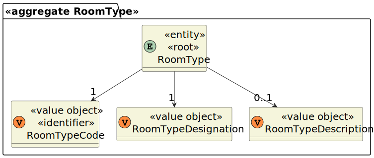
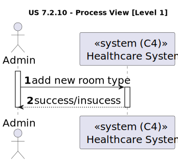
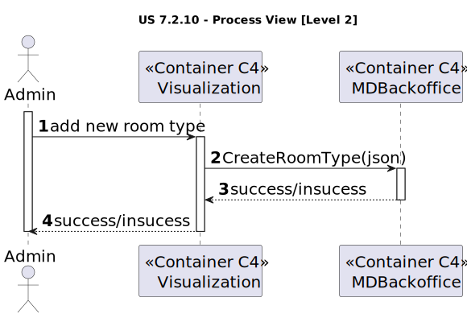
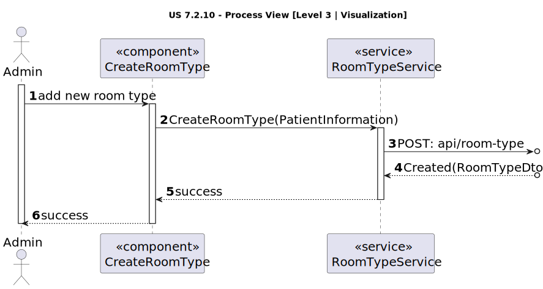
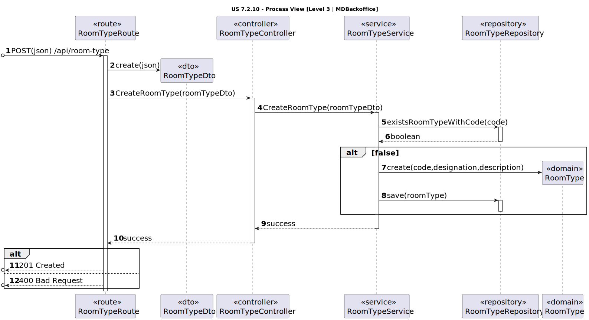

# US 7.2.10

<!-- TOC -->
- [US 7.2.10](#us-7210)
  - [1. Context](#1-context)
  - [2. Requirements](#2-requirements)
  - [3. Analysis](#3-analysis)
    - [Domain Model](#domain-model)
  - [4. Design](#4-design)
    - [4.1. Realization](#41-realization)
      - [Logical View](#logical-view)
      - [Process View](#process-view)
        - [Level 1](#level-1)
        - [Level 2](#level-2)
        - [Level 3](#level-3)
      - [Development View](#development-view)
      - [Physical View](#physical-view)
  - [5. Implementation](#5-implementation)
  - [6. Testing](#6-testing)
<!-- TOC -->

## 1. Context

This is the first time this user story is being developed.

## 2. Requirements

**US 7.2.10:** As an Admin, I want to add new types of rooms, so that I can reflect on the available medical procedures in the system.

**Acceptance Criteria:**

- 7.2.10.1: A room type must have an internal code, a designation, an optional longer description and an indicator if the room is suitable for surgeries.
- 7.2.10.2: The code is entered by the admin.
- 7.2.10.2: The code must be unique.
- 7.2.10.3: The code must be 8 characters long, with only letters, numbers and dashes ("-"), spaces are not allowed.
- 7.2.10.4: The designation must be a free text field, with 100 characters maximum.

**Dependencies/References:**

This user story doesn't have dependencies.

**Client Clarifications:**

> **Question:** What will be the Room Type fields to input when adding?
>
> **Answer:** A room type is characterized by an internal code, a designation and an optional longer description. it also indicates if it the room type is suitable for surgeries or not

> **Question:** With the characterization of the room type, the internal code must have a format? If so, what will be the format? For the designation, exists any restrition (max number of characters, is unique, etc.)? If so, what restrition?
>
> **Answer:** Code is a text entered by the Admin. it must be 8 characters long, no spaces, only letters, numbers, and dashes ("-") are allowed. it must be unique.
designation. free text, alphanumeric, 100 characters max.

## 3. Analysis

This feature enables the admin to create new room types by providing the following information:

- **Internal Code:** Must be unique, containing only letters, numbers, and dashes ("-"). Spaces are not allowed.
- **Designation:** A required field, with a maximum of 100 characters.
- **Description:** An optional field.

Once the information is entered, the system validates that the code is both unique and adheres to the specified rules. If all requirements are met, the system registers the new room type.

### Domain Model

## 4. Design

### 4.1. Realization

The logical, physical, development and scenario views diagrams are generic for all the use cases of the backoffice component.

#### Logical View

The diagrams can be found in the [team decision views folder](../../team-decisions/views/general-views.md#1-logical-view).

#### Process View

##### Level 1

##### Level 2

##### Level 3

- _Visualization_ 

- _MDBackoffice_ 

#### Development View

The diagrams can be found in the [team decision views folder](../../team-decisions/views/general-views.md#3-development-view).

#### Physical View

The diagrams can be found in the [team decision views folder](../../team-decisions/views/general-views.md#4-physical-view).

## 5. Implementation

//TO BE DONE

## 6. Testing

This functionality was tested with:

- Unit tests for the controller. 
- Unit tests for the service.
- Unit tests for the room type entity.
- Integration tests for controller and service.
- Integration tests for service and domain.
- Integration tests with Postman.
- Unit tests for the visualization component
- E2E tests.
 
