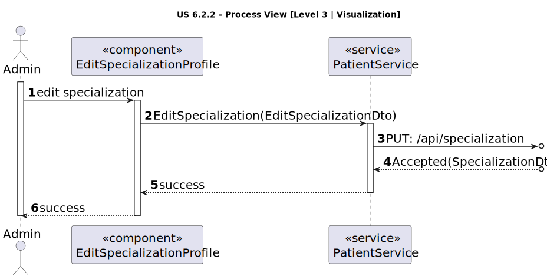

# US 7.2.13

<!-- TOC -->
- [US 7.2.13](#us-7213)
  - [1. Context](#1-context)
  - [2. Requirements](#2-requirements)
  - [3. Analysis](#3-analysis)
    - [Domain Model](#domain-model)
  - [4. Design](#4-design)
    - [4.1. Realization](#41-realization)
      - [Logical View](#logical-view)
      - [Process View](#process-view)
        - [Level 1](#level-1)
        - [Level 2](#level-2)
        - [Level 3](#level-3)
      - [Development View](#development-view)
      - [Physical View](#physical-view)
  - [5. Implementation](#5-implementation)
  - [6. Testing](#6-testing)
<!-- TOC -->

## 1. Context

This user story is being implemented for the first time.

## 2. Requirements

**US 7.2.13:** As an Admin, I want to edit Specializations, so that I can update or correct information about the staff and operation type (procedure).

**Acceptance Criteria:**

- 7.2.13.1: Only the designation and description can be edited, still following the requirements.

**Dependencies/References:**

This user story depends on [7.2.11](../../1220683/us-7.2.11/readme.md), as that user story is responsible for creating specializations.

## 3. Analysis

This functionality allows the admin to edit the available specializations, with only the following fields being editable:  

- Designation  
- Description  

To achieve this, all specializations must be listed, allowing the admin to select one. Once a specialization is chosen, the edit option becomes available, enabling the admin to input updated information.  

Afterward, the system will update the details for the selected specialization. Notably, updating both attributes is optional.

### Domain Model

## 4. Design

### 4.1. Realization

The logical, physical, development and scenario views diagrams are generic for all the use cases of the backoffice component.

#### Logical View

The diagrams can be found in the [team decision views folder](../../team-decisions/views/general-views.md#1-logical-view).

#### Process View

##### Level 1

##### Level 2

##### Level 3

- _Visualization_ 

- _MDBackoffice_ 

#### Development View

The diagrams can be found in the [team decision views folder](../../team-decisions/views/general-views.md#3-development-view).

#### Physical View

The diagrams can be found in the [team decision views folder](../../team-decisions/views/general-views.md#4-physical-view).

## 5. Implementation

//TO BE DONE

## 6. Testing

This functionality was tested with:

- Unit tests for the controller. 
- Unit tests for the service.
- Unit tests for the specialization entity.
- Integration tests for controller and service.
- Integration tests for service and domain.
- Integration tests with Postman.
- Unit tests for the visualization component