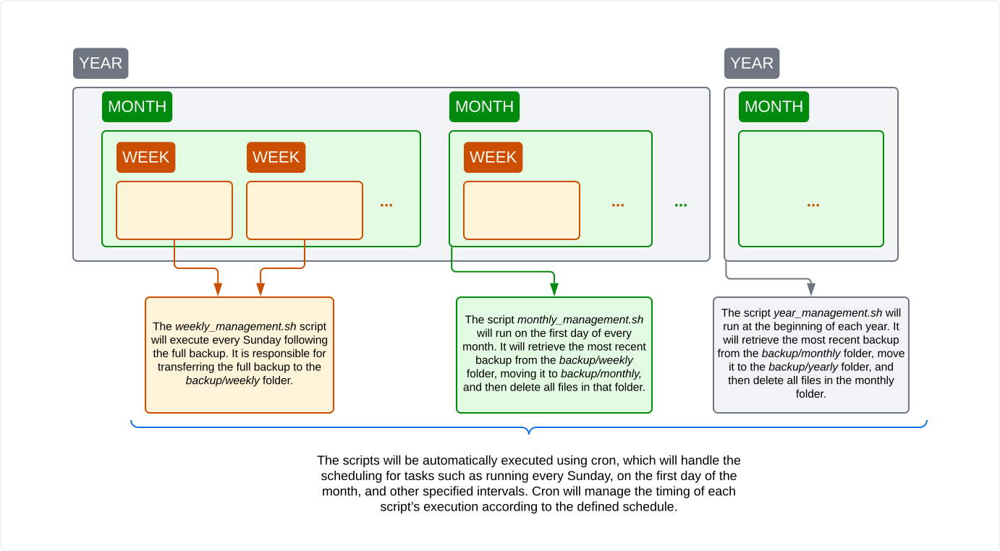

# US 7.4.4

<!-- TOC -->
- [US 7.4.4](#us-744)
  - [1. Context](#1-context)
  - [2. Requirements](#2-requirements)
  - [3. Analysis](#3-analysis)
  - [4. Design](#4-design)
  - [5. Implementation](#5-implementation)
    - [Weekly Script - _weekly\_management.sh_](#weekly-script---weekly_managementsh)
      - [Additional Steps](#additional-steps)
    - [Monthly Script - _monthly\_management.sh_](#monthly-script---monthly_managementsh)
      - [Additional Steps](#additional-steps-1)
    - [Yearly Script - _yearly\_management.sh_](#yearly-script---yearly_managementsh)
      - [Additional Steps](#additional-steps-2)
<!-- TOC -->

## 1. Context

This user story is being implemented for the first time.

## 2. Requirements

**US 7.4.4:** As a system administrator, I want a script to be created using the backup prepared in previous US to manage the files resulting from this backup on the following schedule. 1 backup per month for the last year, 1 backup per week for the last month, 1 backup per day for the last week

**Acceptance Criteria:**

- 7.4.4.1: The script must ensure that only one backup per month is retained for the past year.
- 7.4.4.2: The script must ensure that only one backup per week is retained for the past month.
- 7.4.4.3: The script must ensure that only one backup per day is retained for the past week.
- 7.4.4.4: The script must run automatically to enforce the retention policy based on the backup schedule.

**Dependencies/References:**

This user story depends on [7.4.3](../../1220738/us-7.4.3/readme.md), as this is the functionality where the backup will be created.

## 3. Analysis

For this functionality a script will be developed in order to manage the backup files. Taking that into account, the script will need to:

- Retrieve all backup files data from the cloud storage, including creation dates.
- Filter Backups based on the defined retention schedule.
- Identify and remove files that do not fit the retention policy.
- Log actions performed by the script.

## 4. Design



## 5. Implementation

### Weekly Script - _weekly_management.sh_

```console
#!/bin/bash

# Define the source and destination paths
FULL_BACKUP_PATH="/path/to/full_backup" ## to be defined
WEEKLY_FOLDER_PATH="/path/to/weekly" ## to be defined

# Ensure the weekly folder exists
if [ ! -d "$WEEKLY_FOLDER_PATH" ]; then
  mkdir -p "$WEEKLY_FOLDER_PATH"
fi

# Get the current date for naming the backup
DATE=$(date +"%Y-%m-%d")

# Move the full_backup to the weekly folder with a timestamp
mv "$FULL_BACKUP_PATH" "$WEEKLY_FOLDER_PATH/full_backup_$DATE"

# Log the operation (optional)
echo "Moved full_backup to weekly folder on $DATE" >> /var/log/full_backup.log
```

#### Additional Steps
  
1. Save the script as _weekly_management.sh_ and make it executable:

```console
chmod +x weekly_management.sh
```

2. Edit your crontab by adding the following line to schedule the script every Sunday at 02:30:

```console
30 2 * * 0 /scripts/weekly_management.sh
```

### Monthly Script - _monthly_management.sh_

```console
#!/bin/bash

# Define the source and destination paths
WEEKLY_FOLDER_PATH="/path/to/weekly" ## to be defined
MONTHLY_FOLDER_PATH="/path/to/monthly" ## to be defined
 
# Ensure the monthly folder exists
if [ ! -d "$MONTHLY_FOLDER_PATH" ]; then
  mkdir -p "$MONTHLY_FOLDER_PATH"
fi

# Find the most recent backup in the weekly folder
LATEST_BACKUP=$(ls -t "$WEEKLY_FOLDER_PATH" | head -n 1)

if [ -n "$LATEST_BACKUP" ]; then
  # Move the latest backup to the monthly folder
  mv "$WEEKLY_FOLDER_PATH/$LATEST_BACKUP" "$MONTHLY_FOLDER_PATH/$LATEST_BACKUP"

  # Log the operation (optional)
  echo "Moved $LATEST_BACKUP to monthly folder on $(date +'%Y-%m-%d')" >> /var/log/monthly_backup.log

  # Delete all files in the weekly folder
  rm -rf "$WEEKLY_FOLDER_PATH"/*

  echo "Cleaned up weekly folder on $(date +'%Y-%m-%d')" >> /var/log/monthly_backup.log
else
  echo "No backups found in weekly folder on $(date +'%Y-%m-%d')" >> /var/log/monthly_backup.log
fi
```

#### Additional Steps
  
1. Save the script as _monthly_management.sh_ and make it executable:

```console
chmod +x monthly_management.sh
```

2. Add the following line to schedule the script on the first day of every month at 02:30:

```console
30 2 1 * * /scripts/monthly_management.sh
```

### Yearly Script - _yearly_management.sh_

```console
#!/bin/bash

# Define the source and destination paths
MONTHLY_FOLDER_PATH="/path/to/monthly" ## to be defined
YEARLY_FOLDER_PATH="/path/to/yearly" ## to be defined

# Ensure the yearly folder exists
if [ ! -d "$YEARLY_FOLDER_PATH" ]; then
  mkdir -p "$YEARLY_FOLDER_PATH"
fi

# Find the most recent backup in the monthly folder
LATEST_BACKUP=$(ls -t "$MONTHLY_FOLDER_PATH" | head -n 1)

if [ -n "$LATEST_BACKUP" ]; then
  # Copy the latest backup to the yearly folder
  cp "$MONTHLY_FOLDER_PATH/$LATEST_BACKUP" "$YEARLY_FOLDER_PATH/$LATEST_BACKUP"

  # Log the operation (optional)
  echo "Copied $LATEST_BACKUP to yearly folder on $(date +'%Y-%m-%d')" >> /var/log/yearly_backup.log

  # Delete all files in the monthly folder
  rm -rf "$MONTHLY_FOLDER_PATH"/*

  echo "Cleaned up monthly folder on $(date +'%Y-%m-%d')" >> /var/log/yearly_backup.log
else
  echo "No backups found in monthly folder on $(date +'%Y-%m-%d')" >> /var/log/yearly_backup.log
fi
```

#### Additional Steps
  
1. Save the script as yearly_management.sh_ and make it executable:

```console
chmod +x yearly_management.sh
```

2. Add the following line to schedule the script on the first day of every year at 02:30:

```console
30 2 1 1 * /scripts/yearly_management.sh
```
