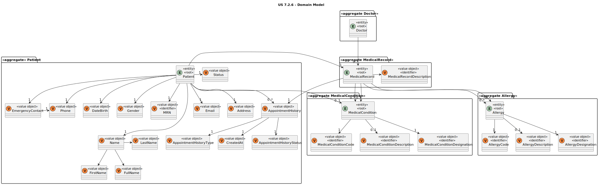
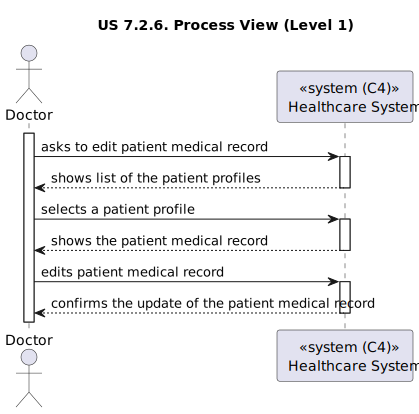
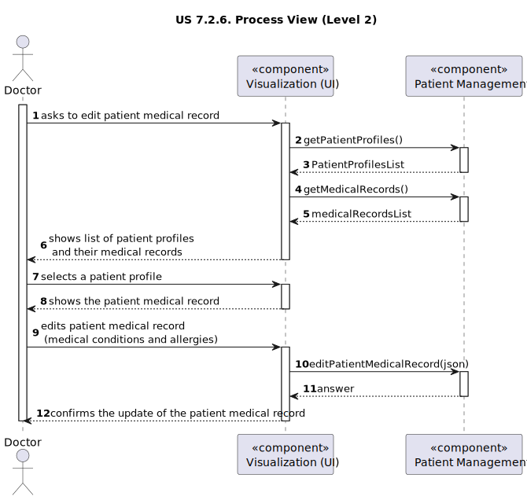
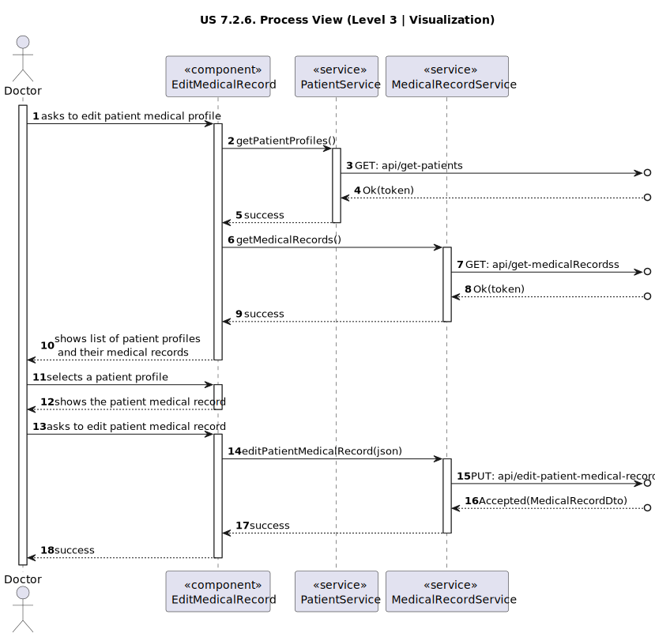
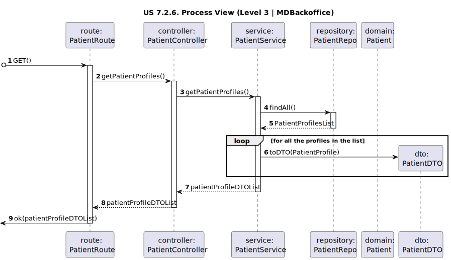
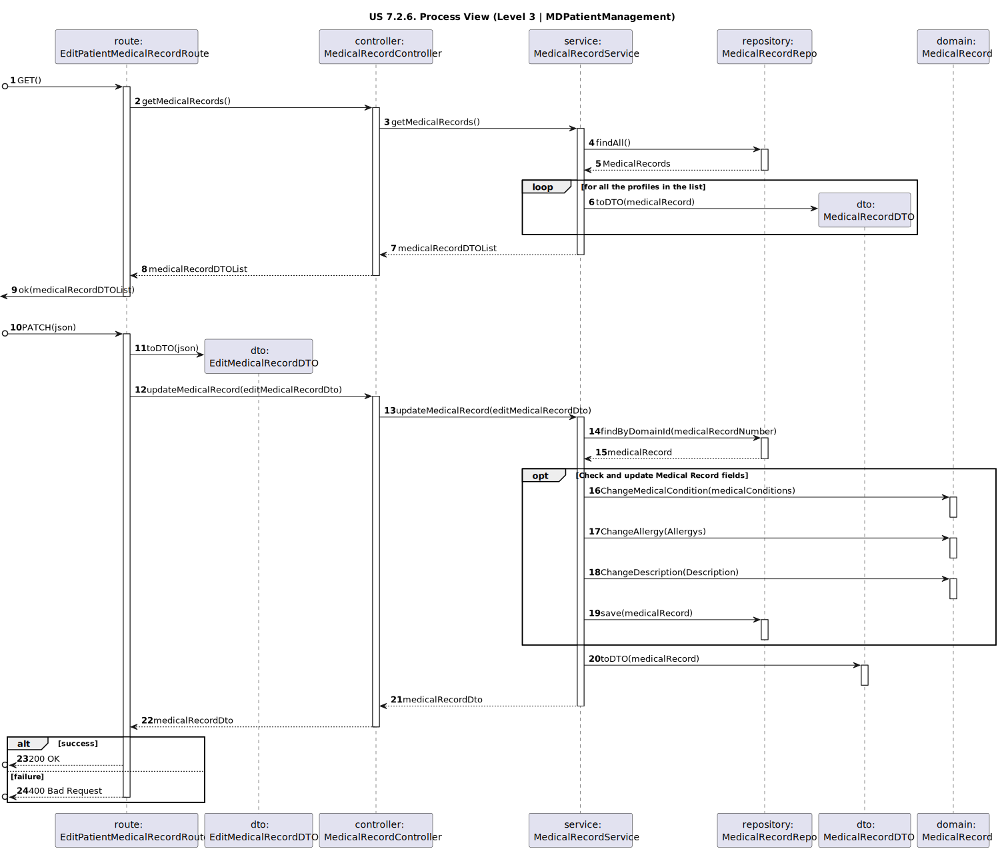

# US 7.2.6

<!-- TOC -->
* [US 7.2.6](#us-726)
  * [1. Context](#1-context)
  * [2. Requirements](#2-requirements)
  * [3. Analysis](#3-analysis)
    * [Domain Model](#domain-model)
  * [4. Design](#4-design)
    * [4.1. Realization](#41-realization)
      * [Logical View](#logical-view)
      * [Process View](#process-view)
        * [Level 1](#level-1)
        * [Level 2](#level-2)
        * [Level 3](#level-3)
      * [Development View](#development-view)
      * [Physical View](#physical-view)
    * [4.2. Applied Patterns](#42-applied-patterns)
<!-- TOC -->

## 1. Context

This is the first time this US is being worked on.

## 2. Requirements

**US 7.2.6:** As a Doctor, I want to update the Patient Medical Record, namely respecting Medical Conditions and Allergies.

**Acceptance Criteria:**

**US 7.2.6.1:** Doctors can only update the information regarding the Medical Conditions, Allergies and Description in the Patient
Medical Record.

**US 7.2.6.2:** Doctors should use Allergies and Medical Conditions previously created.

**US 7.2.6.3:** Doctors can access the Patient Medical Record and change the information.

**Dependencies/References:**

**US 7.2.2:** The Admin must add an Allergy, so that it can be used to edit the Patient Medical Record. 

**US 7.2.4:** The Admin must add a Medical Condition, so that it can be used to edit the Patient Medical Record.

**Client Clarifications:**

>**Question:** The medical record can include multiple allergies and medical conditions.
> Are these details sufficient, or do you consider a free text field necessary?
>
>**Answer**: Yes, it can include the record of multiple allergies and conditions.
> An example of a medical record is the following:
>
> **Alergias**
>   - **Penicilina**: Provoca erupções cutâneas severas e dificuldade respiratória.
>   - **Amendoim**: Causa anafilaxia; utiliza auto-injetor de adrenalina.
>   - **Ácaros**: Espirros e olhos lacrimejantes leves.
>
> **Condições Médicas**
>   - **Asma** (diagnosticada em 2005)
>   - **Hipertensão Arterial** (diagnosticada em 2018)
>   - **Rinite Alérgica Sazonal** (diagnosticada em 2010)
>   - **Gastrite** (diagnosticada em 2021)
>
> **Histórico Médico**
>   - **2010**: Diagnosticado com rinite alérgica sazonal, tratado com anti-histamínicos.
>   - **2015**: Hospitalização por exacerbação grave da asma; tratado com corticoides e nebulização.
>   - **2018**: Diagnosticado com hipertensão arterial; prescrito Losartan 50 mg diário.
>   - **2021**: Queixas de dores no estômago; endoscopia confirmou gastrite. Tratado com inibidores da bomba de prótons (IBP).
>   - **2023**: Pequena cirurgia para remoção de lesão benigna na pele das costas.
>
> **Histórico Médico Familiar**
>   - **Pai**: Hipertensão arterial, Diabetes Tipo 2.
>   - **Mãe**: Asma, Osteoporose.
>   - **Irmãos**: Sem histórico médico significativo.
>
> **Medicamentos Atuais**
>   - **Inalador de Salbutamol**: Conforme necessidade para asma.
>   - **Losartan 50 mg**: Uma vez ao dia para hipertensão.
>   - **Cetirizina 10 mg**: Conforme necessidade para rinite alérgica.
>   - **Omeprazol 20 mg**: Uma vez ao dia para gastrite.
>
> **Vacinas**
>   - Esquema vacinal completo, incluindo:
      >     - **Vacina contra a gripe** (última dose: outubro de 2023).
>     - **Reforço da COVID-19** (última dose: setembro de 2023).
>     - **Reforço da vacina antitetânica e diftérica (Tdap)** (última dose: 2022).
>
> **Estilo de Vida e Hábitos**
>   - **Tabaco**: Não fumador.
>   - **Álcool**: Consumo ocasional e social.
>   - **Dieta**: Alimentação equilibrada, com indulgência ocasional em alimentos picantes (provavelmente agravando a gastrite).
>   - **Exercício**: Caminhadas de 30 minutos diários, prática de ioga duas vezes por semana.
>
> **Notas da Visita Recente (Novembro de 2024)**
>   - Queixas de leve falta de ar durante exercício físico.
>   - Espirometria indica função pulmonar estável.
>   - Pressão arterial: 138/86 mmHg.
>   - Orientação: manter a medicação atual e o estilo de vida saudável.

## 3. Analysis

This functionality centers in the edit of the allergies, medical conditions and description information on a patient medical record,
by the Doctor.

First the Doctor will choose the Patient he wants to edit the medical record and then select it. Then can be selected the
follow editable fields:
- allergies
- medical condition
- description

### Domain Model

## 4. Design

### 4.1. Realization

The logical, physical, development and scenario views diagrams are generic for all the use cases of the backoffice component.

#### Logical View

The diagrams are available in the [team decision views folder](../../team-decisions/views/general-views.md#1-logical-view).

#### Process View

##### Level 1

##### Level 2

##### Level 3

- _Visualization_ 
  

- _MDBackoffice_ 
  

- _MDPatientManagement_ 
  

#### Development View

The diagrams are available in the [team decision views folder](../../team-decisions/views/general-views.md#3-development-view).

#### Physical View

The diagrams are available in the [team decision views folder](../../team-decisions/views/general-views.md#4-physical-view).

### 4.2. Applied Patterns

> #### **Repository Pattern**
>
>* **Components:** PatientRepository, MedicalRecordRepository
>
> The repositories handle data access and retrieval, isolating the database interaction logic from services and other
> layers. This approach abstracts the persistence logic, promoting separation of concerns.

> #### **DTO (Data Transfer Object) Pattern**
>
>* **Components:** PatientDTO, MedicalRecordRepository
>
> DTOs are utilized to transfer data between layers, particularly from the controller layer to the service layer and
> vice versa. Their main purpose is to convey data in a structured and decoupled manner without revealing the internal
> representations of entities. Additionally, this pattern is not required to adhere to business rules.

> #### **Facade Pattern**
>
>* **Components:** PatientService, MedicalRecordService
>
> These services function as a facade, simplifying the interaction with lower-level components such as repositories.
> The controller communicates with these service facades, concealing the complexity from the upper layers.
