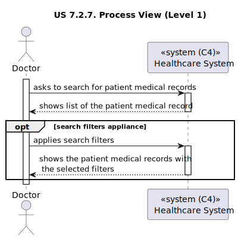
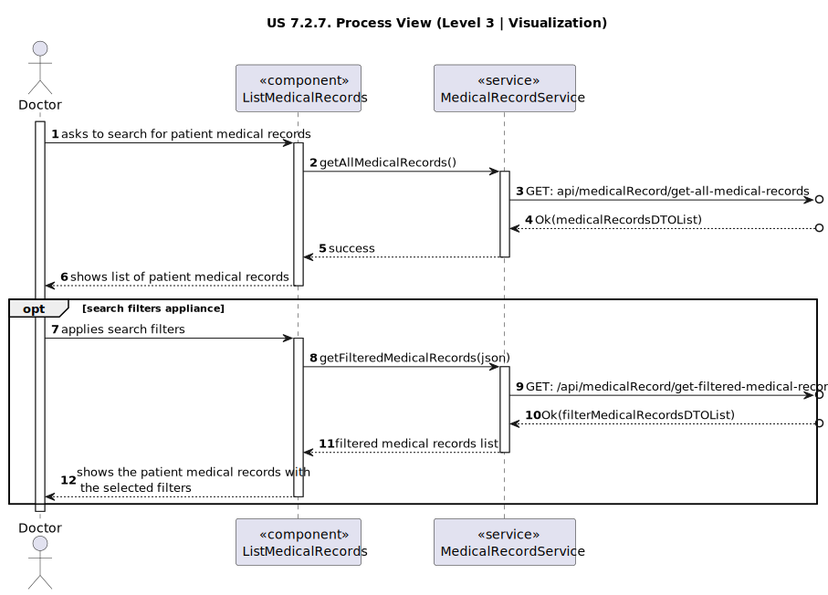
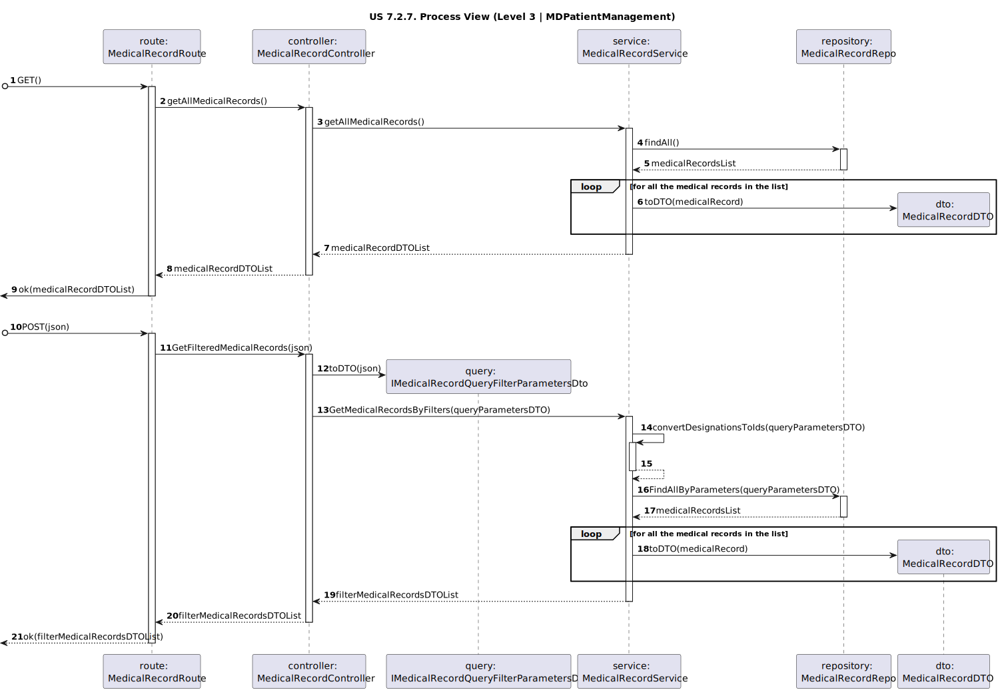

# US 7.2.7

<!-- TOC -->
* [US 7.2.7](#us-727)
  * [1. Context](#1-context)
  * [2. Requirements](#2-requirements)
  * [3. Analysis](#3-analysis)
    * [Domain Model](#domain-model)
  * [4. Design](#4-design)
    * [4.1. Realization](#41-realization)
      * [Logical View](#logical-view)
      * [Process View](#process-view)
        * [Level 1](#level-1)
        * [Level 2](#level-2)
        * [Level 3](#level-3)
      * [Development View](#development-view)
      * [Physical View](#physical-view)
    * [4.2. Applied Patterns](#42-applied-patterns)
<!-- TOC -->

## 1. Context

This is the first time this US is being worked on.

## 2. Requirements

**US 7.2.7:** As a Doctor, I want to search for entries in the Patient Medical Record, namely respecting Medical 
Conditions and Allergies.

**Acceptance Criteria:**

**US 7.2.7.1:** Doctor can search for medical conditions and allergies.

**US 7.2.7.2:** The system will display the patient medical records in a searchable and filterable view.

**US 7.2.7.3:** Each entry in the list includes patient medical records details (e.g., medical conditions and allergies).

**US 7.2.7.4:** The Doctor is notified if are not found results for the search terms.

**Dependencies/References:**

**US 7.2.2:** The Admin must add an Allergy, so that it can be searched.

**US 7.2.4:** The Admin must add a Medical Condition, so that it can be searched.

**Client Clarifications:**

>**Question:** In user story 7.2.7, does it refer to filtering Medical Records by Allergies and Medical Conditions, or to 
> searching for Allergies and Medical Conditions within a Medical Record?
>
>**Answer**: The goal is to search for medical record entries that mention specific allergies or medical conditions.

>**Question:** In User Story 7.2.7 ("As a Doctor, I want to search for entries in the Patient Medical Record, namely 
> respecting Medical Conditions and Allergies."), it is mentioned that the goal is to search for entries within the 
> Medical Record related to allergies and medical conditions. How would this work? Following the example given in 
> another response on this forum, the Medical Record would be divided into sections for allergies, medical conditions, 
> nd a free text section. Assuming that allergies, for instance, appear at the top, how would the search results be 
> displayed to the user?
>
>**Answer**: As indicated, the patient's Medical Record is a complex object with several subobjects. When the user 
> queries the medical record, they should be able to view each section of it and have the possibility to search within 
> each section. For example, the medical record page shows a table with allergy entries, another table with medical 
> condition entries, another table with free-text entries, and so on.

## 3. Analysis

This functionality centers in the search of the allergies and medical condition information on a patient medical record,
by the Doctor.

Once the filters are applied, the system displays the patient medical record in a searchable list with the following attributes:
- Allergies
- Medical Conditions

### Domain Model

## 4. Design

### 4.1. Realization

The logical, physical, development and scenario views diagrams are generic for all the use cases of the backoffice component.

#### Logical View

The diagrams are available in the [team decision views folder](../../team-decisions/views/general-views.md#1-logical-view).

#### Process View

##### Level 1

##### Level 2

##### Level 3

- _Visualization_ 
  

- _MDPatientManagement_ 
  

#### Development View

The diagrams are available in the [team decision views folder](../../team-decisions/views/general-views.md#3-development-view).

#### Physical View

The diagrams are available in the [team decision views folder](../../team-decisions/views/general-views.md#4-physical-view).

### 4.2. Applied Patterns

> #### **Repository Pattern**
>
>* **Components:** MedicalRecordRepository
>
> The repositories handle data access and retrieval, isolating the database interaction logic from services and other
> layers. This approach abstracts the persistence logic, promoting separation of concerns.

> #### **DTO (Data Transfer Object) Pattern**
>
>* **Components:** MedicalRecordDTO
>
> DTOs are utilized to transfer data between layers, particularly from the controller layer to the service layer and
> vice versa. Their main purpose is to convey data in a structured and decoupled manner without revealing the internal
> representations of entities. Additionally, this pattern is not required to adhere to business rules.

> #### **Facade Pattern**
>
>* **Components:** MedicalRecordService
>
> These services function as a facade, simplifying the interaction with lower-level components such as repositories.
> The controller communicates with these service facades, concealing the complexity from the upper layers.

