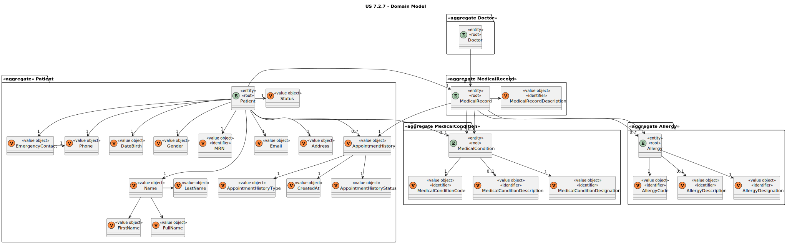

# US 7.2.7

<!-- TOC -->
* [US 7.2.7](#us-727)
  * [1. Context](#1-context)
  * [2. Requirements](#2-requirements)
  * [3. Analysis](#3-analysis)
    * [Domain Model](#domain-model)
  * [4. Design](#4-design)
    * [4.1. Realization](#41-realization)
      * [Views](#views)
    * [4.2. Domain Model Excerpt](#42-domain-model-excerpt)
    * [4.3. Applied Patterns](#43-applied-patterns)
  * [5. Implementation](#5-implementation)
  * [6. Testing](#6-testing)
<!-- TOC -->

## 1. Context

This is the first time this US is being worked on.

## 2. Requirements

**US 7.2.7:** As a Doctor, I want to search for entries in the Patient Medical Record, namely respecting Medical 
Conditions and Allergies.

**Acceptance Criteria:**

**US 7.2.7.1:** Doctor can search for medical conditions and allergies.

**US 7.2.7.2:** The system will display the patient medical records in a searchable and filterable view.

**US 7.2.7.3:** Each entry in the list includes patient medical records details (e.g., medical conditions and allergies).

**US 7.2.7.4:** The Doctor is notified if are not found results for the search terms.

**Dependencies/References:**

**US 7.2.2:** The Admin must add an Allergy, so that it can be searched.

**US 7.2.4:** The Admin must add a Medical Condition, so that it can be searched.

**Client Clarifications:**

>**Question:** In user story 7.2.7, does it refer to filtering Medical Records by Allergies and Medical Conditions, or to 
> searching for Allergies and Medical Conditions within a Medical Record?
>
>**Answer**:

## 3. Analysis

This functionality centers in the search of the allergies and medical condition information on a patient medical record,
by the Doctor.

Once the filters are applied, the system displays the patient medical record in a searchable list with the following attributes:
- Allergies
- Medical Condition

### Domain Model

## 4. Design

### 4.1. Realization

//TO BE DONE

#### Views

//TO BE DONE

### 4.2. Domain Model Excerpt

//TO BE DONE

### 4.3. Applied Patterns

//TO BE DONE

## 5. Implementation

//TO BE DONE

## 6. Testing

//TO BE DONE