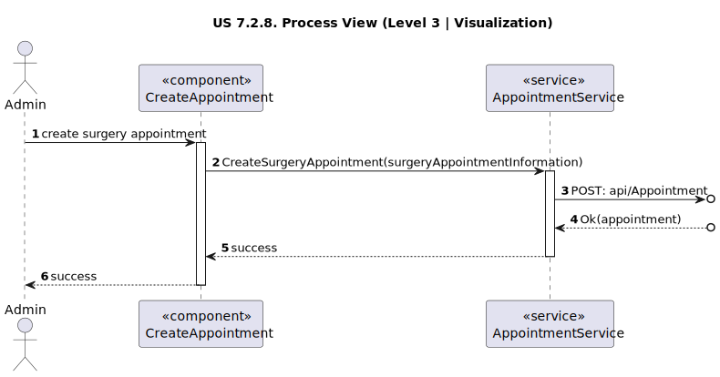
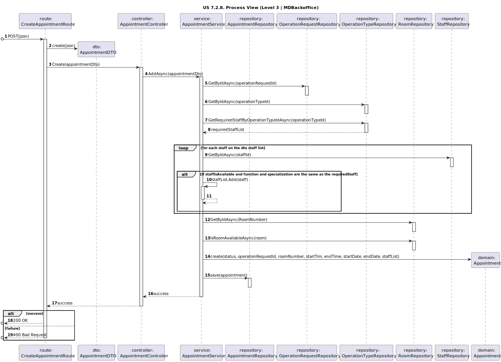

# US 7.2.8

<!-- TOC -->
* [US 7.2.8](#us-728)
  * [1. Context](#1-context)
  * [2. Requirements](#2-requirements)
  * [3. Analysis](#3-analysis)
    * [Domain Model](#domain-model)
  * [4. Design](#4-design)
    * [4.1. Realization](#41-realization)
      * [Logical View](#logical-view)
      * [Process View](#process-view)
        * [Level 1](#level-1)
        * [Level 2](#level-2)
        * [Level 3](#level-3)
      * [Development View](#development-view)
      * [Physical View](#physical-view)
    * [4.2. Applied Patterns](#42-applied-patterns)
<!-- TOC -->

## 1. Context

This is the first time this US is being worked on.

## 2. Requirements

**US 7.2.8:** As a Doctor, I want to create a Surgery Appointment, so that the Patient doesn't need to wait for the
automatically generated planning.

**Acceptance Criteria:**

**US 7.2.8.1:** The doctor must be able to create a surgery appointment by transforming an existing operation request 
into an appointment.

**US 7.2.8.2:** While creating the appointment, the doctor must specify:

- Surgery room
- Date and time for the surgery start
- Team composition, including: Doctors, Nurses, Anesthetists, Cleaners (if applicable, based on operation type)

**US 7.2.8.3:** The system must ensure all selected resources (room, team members, equipment) are available for the 
specified time, taking into account the operation's duration and required phases (anesthesia, surgery, and cleaning).

**US 7.2.8.4:** The system confirms successful submission of the appointment logs the request in the patient's
medical history.

**Dependencies/References:**

**US 5.1.16 && 6.1.14:** The Doctor must create an Operation Request, so that it can be used to create an Appointment.

**Client Clarifications:**

>**Question:** Should the doctor be able to make a surgery appointment without making a prior operation request for 
> said appointment?
>
>**Answer**: The doctor must be able to "transform" an existing operation request into an actual appointment by 
> specifying the room, date and team of the surgery. the system must ensure all the resources and personnel is available
> at the selected time according to the operation type duration.

>**Question:** As a follow-up question, what exactly can the doctor update about the appointment? Can they, for example,
> change the surgery room for the surgery?
>
>**Answer**: after the appointment is planned, it is possible to update the team, room and date. the system must ensure 
> all the resources and personnel is available at the selected time according to the operation type duration.

>**Question:** According to a previous answer about this requirement, when the doctor attempts the creation of an 
> appointment, they specify room, date and team. But do they also specify the time in which the surgery should start?
>
>**Answer**: yes

>**Question:** Regarding the team selected by the doctor when creating the appointment, does this team include only 
> doctors, doctors and anesthetists, or doctors, anesthetists and cleaners?
>
>**Answer**: it must include the whole team that conforms to the team composition according to the operation type 
> specification

>**Question:** When the doctor selects the team for the Appointment, that includes doctors and nurses. Regarding cleaners,
> which staff (doctors, nurses, interns) can be selected for that role? And is there any criteria for that selection?
>
>**Answer**: the doctor only selects the medical team.

## 3. Analysis

The main objective of this functionality is to allow doctors to create surgery appointments based on an existing 
operation request. This ensures that patients can have their surgeries scheduled without relying solely on automatically
generated planning.

To achieve this, the doctor must transform an existing operation request into an appointment by providing the following 
information:

- Surgery Room: The specific room where the surgery will take place
- Date and Time: The precise start time for the surgery.
- Team Composition: Includes doctors, nurses, anesthetists, and cleaners (if applicable), adhering to the operation type
requirements.

As a result, the appointment should include:

- Operation request ID
- Room
- Date and Time of the surgery
- The team composition, categorized by their roles (e.g., Doctors, Nurses, Anesthetists, Cleaners).

Once all validations are successfully completed, the system confirms the creation of the appointment and logs it in the 
patient’s medical history.

### Domain Model

## 4. Design

### 4.1. Realization

The logical, physical, development and scenario views diagrams are generic for all the use cases of the backoffice component.

#### Logical View

The diagrams are available in the [team decision views folder](../../team-decisions/views/general-views.md#1-logical-view).

#### Process View

##### Level 1

##### Level 2

##### Level 3

- _Visualization_ 
  

- _MDBackoffice_ 
  

#### Development View

The diagrams are available in the [team decision views folder](../../team-decisions/views/general-views.md#3-development-view).

#### Physical View

The diagrams are available in the [team decision views folder](../../team-decisions/views/general-views.md#4-physical-view).

### 4.2. Applied Patterns

> #### **Repository Pattern**
>
>* **Components:** AppointmentRepository, OperationRequestRepository, OperationTypeRepository, RoomRepository, StaffRepository
>
> The repositories handle data access and retrieval, isolating the database interaction logic from services and other
> layers. This approach abstracts the persistence logic, promoting separation of concerns.

> #### **DTO (Data Transfer Object) Pattern**
>
>* **Components:** AppointmentDTO
>
> DTOs are utilized to transfer data between layers, particularly from the controller layer to the service layer and
> vice versa. Their main purpose is to convey data in a structured and decoupled manner without revealing the internal
> representations of entities. Additionally, this pattern is not required to adhere to business rules.

> #### **Facade Pattern**
>
>* **Components:** AppointmentService
>
> These services function as a facade, simplifying the interaction with lower-level components such as repositories.
> The controller communicates with these service facades, concealing the complexity from the upper layers.

