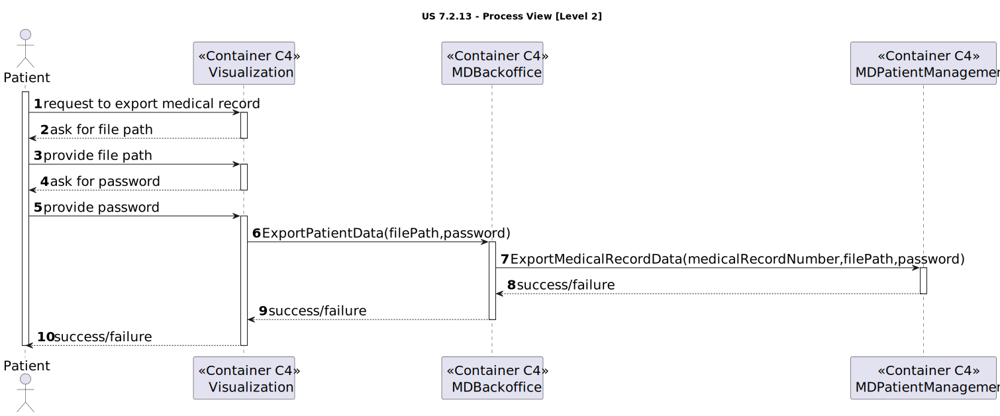

# US 7.6.1

<!-- TOC -->
- [US 7.6.1](#us-761)
  - [1. Context](#1-context)
  - [2. Requirements](#2-requirements)
  - [3. Analysis](#3-analysis)
  - [4. Design](#4-design)
    - [4.1. Realization](#41-realization)
      - [Logical View](#logical-view)
      - [Process View](#process-view)
        - [Level 1](#level-1)
        - [Level 2](#level-2)
        - [Level 3](#level-3)
      - [Development View](#development-view)
      - [Physical View](#physical-view)
  - [5. Implementation](#5-implementation)
  - [6. Testing](#6-testing)
<!-- TOC -->

## 1. Context

This is the first time this functionality is being presented.

## 2. Requirements

**US 7.6.1:** As a Patient, I want to download my medical history in a portable and secure format, so that I can easily transfer it to another healthcare provider.

**Acceptance Criteria:**

- **7.6.1.1.** The medical history should be converted into a file.
- **7.6.1.2.** The medical history should be a file with a secure format.
- **7.6.1.3.** To download their medical records, patients should access their account preferences/settings page.
- **7.6.1.4.** The format must be universally acceptable and readable by other healthcare systems.

**Dependencies/References:**

This user story is dependent on the existence of a patient profile (US5.1.8), patient settings (US 6.2.3), and its medical history (US 7.2.14).

**Client Clarifications:**

> **Question:** "As a Patient, I want to download my medical history in a portable and secure format, so that I can easily transfer it to another healthcare provider."
> What is considered a secure format?
> What is the preferred format/extension of the downloadable file?
>
> **Answer:** YET TO BE ANSWERED.

## 3. Analysis

In this functionality, the patient can access their profile settings, of which should have an option to download their
medical history.

The medical history data should be copied and formated into a file that should be secure. This file can be later transferred
to another healthcare provider by the patient.

The file should consist of the following data:

> Medical History
>   * Allergies
>   * Medical Conditions
>   * Free Text Field - regarding the other information.

## 4. Design

### 4.1. Realization

The logical, physical, development and scenario views diagrams are generic.

#### Logical View

The diagrams can be found in the [team decision views folder](../../team-decisions/views/general-views.md#1-logical-view).

#### Process View

##### Level 1

##### Level 2

##### Level 3

- _Visualization_ 

- _MDBackoffice_ 

- _MDPatientManagement_ 

**Note:**  The file format will remain as a .pdf, but it will require a password for access. We will use `iText7` to generate a password-protected PDF, secured using the patient's password.

#### Development View

The diagrams can be found in the [team decision views folder](../../team-decisions/views/general-views.md#3-development-view).

#### Physical View

The diagrams can be found in the [team decision views folder](../../team-decisions/views/general-views.md#4-physical-view).
## 5. Implementation

//TO BE DONE

## 6. Testing

//TO BE DONE