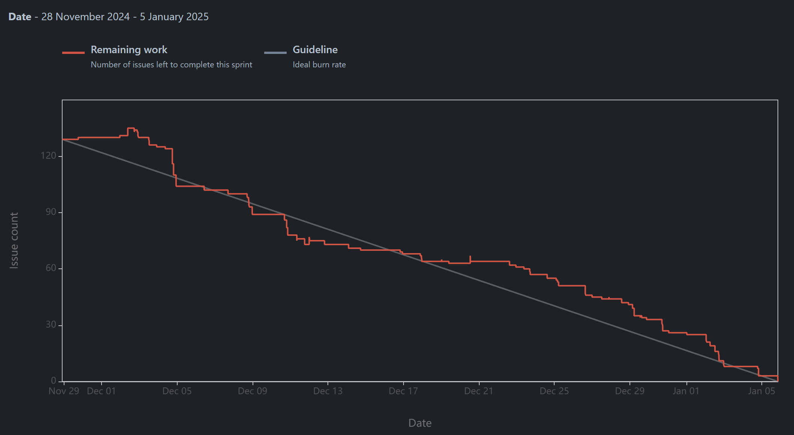

## Sprint Planning

### Team Members

| Name           | Number  |
|----------------|---------|
| Ana Guterres   | 1221933 |
| Matilde Varela | 1220683 |
| José Santos    | 1220738 |
| Rita Barbosa   | 1220841 |

### Task Distribution

Here is the updated table with the new data:

| US                                    | Assigned member | Testing member |
|---------------------------------------|-----------------|----------------|
| [7.1.1](1221933/us-7.1.1/readme.md)   | Ana             | Matilde        |
| 7.1.2                                 | Afonso          | Rita           |
| [7.1.3](1220683/us-7.1.3/readme.md)   | Matilde         | Ana            |
| [7.1.4](1221933/us-7.1.4/readme.md)   | Ana             | Matilde        |
| 7.1.5                                 | Todos           | --             |
| [7.2.1](1220841/us-7.2.1/readme.md)   | Rita            | Afonso         |
| [7.2.2](1220683/us-7.2.2/readme.md)   | Matilde         | Ana            |
| [7.2.3](1220738/us-7.2.3/readme.md)   | Afonso          | Rita           |
| [7.2.4](1220738/us-7.2.4/readme.md)   | Afonso          | Rita           |
| [7.2.5](1220683/us-7.2.5/readme.md)   | Matilde         | Ana            |
| [7.2.6](1221933/us-7.2.6/readme.md)   | Ana             | Matilde        |
| [7.2.7](1221933/us-7.2.7/readme.md)   | Ana             | Matilde        |
| [7.2.8](1221933/us-7.2.8/readme.md)   | Ana             | Matilde        |
| [7.2.9](1220738/us-7.2.9/readme.md)   | Afonso          | Rita           |
| [7.2.10](1220841/us-7.2.10/readme.md) | Rita            | Afonso         |
| [7.2.11](1220841/us-7.2.11/readme.md) | Rita            | Afonso         |
| [7.2.12](1220841/us-7.2.12/readme.md) | Rita            | Afonso         |
| [7.2.13](1220841/us-7.2.13/readme.md) | Rita            | Afonso         |
| [7.2.14](1220683/us-7.2.14/readme.md) | Matilde         | Ana            |
| [7.2.15](1220841/us-7.2.15/readme.md) | Rita            | Afonso         |
| [7.2.16](1220683/us-7.2.16/readme.md) | Matilde         | Ana            |
| [7.3.1](us-7.3.1/readme.md)           | Ana/Matilde     | Ana            |
| [7.3.2](us-7.3.2/readme.md)           | Afonso/Rita     | Afonso         |
| 7.3.3                                 | Todos           | --             |
| [7.4.1](1220683/us-7.4.1/readme.md)   | Matilde         | Ana            |
| [7.4.2](1221933/us-7.4.2/readme.md)   | Ana             | Matilde        |
| [7.4.3](1220738/us-7.4.3/readme.md)   | Afonso          | Rita           |
| [7.4.4](1220841/us-7.4.4/readme.md)   | Rita            | Afonso         |
| [7.4.5](1220841/us-7.4.5/readme.md)   | Rita            | Afonso         |
| [7.4.6](1220683/us-7.4.6/readme.md)   | Matilde         | Ana            |
| [7.4.7](1221933/us-7.4.7/readme.md)   | Ana             | Matilde        |
| [7.4.8](1221933/us-7.4.8/readme.md)   | Ana             | Matilde        |
| [7.4.9](1220841/us-7.4.9/readme.md)   | Rita            | Afonso         |
| [7.4.10](1220738/us-7.4.10/readme.md) | Afonso          | Rita           |
| [7.4.11](1220738/us-7.4.11/readme.md) | Afonso          | Rita           |
| [7.4.12](1220683/us-7.4.12/readme.md) | Matilde         | Ana            |
| [7.5.1](1220683/us-7.5.1/readme.md)   | Matilde         | Ana            |
| [7.5.2](1221933/us-7.5.2/readme.md)   | Ana             | Matilde        |
| [7.5.4](us-7.5.4/readme.md)           | Afonso/Rita     | Rita           |
| [7.6.1](lapr5/us-7.6.1/readme.md)     | Todos           | --             |
| [7.6.2](lapr5/us-7.6.2/readme.md)     | Todos           | --             |
| [7.6.3](lapr5/us-7.6.3/readme.md)     | Todos           | --             |
| [7.6.4](lapr5/us-7.6.4/readme.md)     | Todos           | --             |

### Observations

To ensure smooth project management and progress tracking, we've implemented the following aspects:

1. **Project Management Tool:** Jira has been chosen as our project management tool and will follow the same
   organizational setup we've previously used to maintain consistency.

2. **User Story Breakdown:** Each user story has been divided into smaller, manageable tasks in line with the
   engineering process. These tasks include analysis, requirements gathering, design, immediate implementation after
   design completion, and testing. This structure provides a clearer understanding of the progress for each user story
   and helps facilitate an organized division of commits, addressing concerns raised by some team members about work
   visibility and task tracking.

3. **Module Coordination:** We've designated a coordinator for each module, responsible for ensuring that all aspects of
   their module are well-integrated and properly implemented, which supports more effective cross-module consistency.

4. **Separation of Implementation and Testing:** In order to maintain objectivity and improve quality, the testing of
   each user story will be conducted by a team member other than the one who implemented it. This ensures that all code
   is reviewed and validated by a fresh perspective, helping to identify any overlooked issues.

5. **Code Reviews:** During the implementation phase, there will be at least one code review for each user story to
   ensure quality and adherence to coding standards. The code review will be performed by the same team member
   responsible for testing the user story. Additional reviews may be conducted based on the complexity and state of the
   project. This process helps in catching potential issues early and improves the overall quality of the codebase.

6. **Task Deadlines:** Deadlines have been set for each of the tasks to ensure the team consistently progresses towards
   project goals. This also ensures that everyone remains accountable, preventing anyone from falling behind or slacking
   off.

7. **Sprint Closure:** The final day of each sprint will be reserved for reviewing the work completed, conducting
   self-evaluations, and holding a sprint retrospective. This means that all planned tasks must be completed by the day
   before the sprint ends. If any tasks are left unfinished due to a lack of responsibility or effort from a team
   member, they will be held accountable in subsequent evaluations, reinforcing the importance of commitment and
   accountability.

8. **Daily Logs:** Each team member will maintain daily logs to track and document their work. This helps in providing
   transparency and allows for better progress tracking, ensuring that everyone is contributing to the project
   consistently.
9. **Deadlines:** The team established the following deadlines:
    * Analysis: 04/12/2024
    * Design: 11/12/2024
    * Implementation: 23/12/2024
    * Tests: 29/12/2024
    * Reports: 05/01/2025

These practices have been put in place to enhance team collaboration, ensure timely delivery of tasks, and maintain
high-quality standards throughout the project.

#### DoR - Definition of Ready

The Definition of Ready (DoR) ensures that backlog items are prepared before being included in a sprint. An item is ready when its requirements and acceptance criteria are clear, all dependencies are identified and resolved, and client clarifications are addressed. It must also be small enough to fit within a sprint, technically feasible, and prioritized with effort estimates provided. This ensures the team has all necessary information and resources to start work effectively.

#### DoD - Definition of Done

The Definition of Done (DoD) ensures that items are fully completed and meet quality standards. An item is done when all phases—requirements, design, implementation, and testing—are complete, with dependencies resolved and acceptance criteria met. Code must pass all tests, undergo review, and meet quality standards. Documentation and client sign-off are required. This guarantees the deliverable is ready for use or deployment.

## Sprint Retrospective

* **What Went Well:**
  * Our teamwork was highly effective, ensuring seamless collaboration and maintaining productivity.
  * Based on earlier discussions, we successfully set up essential components at the start of the implementation phase—an improvement from the previous sprint.
  * We addressed issues earlier in the process, leading to quicker resolutions and reducing potential delays.
  * As planned, we focused on tasks directly related to course assessments, helping us avoid feeling overwhelmed.

* **Challenges Faced:**
  * The holiday period impacted our ability to fully meet the implementation and testing deadlines. However, this did not cause setbacks as we were ahead of schedule.

* **Areas for Improvement:**
  * Although this was the final sprint, we recognize the need to enhance our ability to meet deadlines and plan our work more effectively.

* **Burndown Chart**

## [Self-Assessment](3dg-g38-self-assessment.pdf)

## [Honor Pledge](3dg-g38-honors-pledge.pdf)
