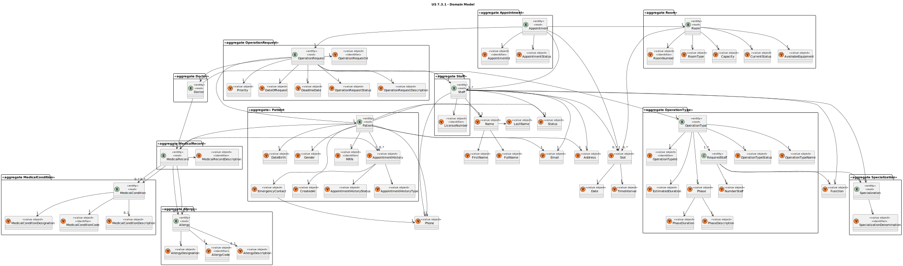
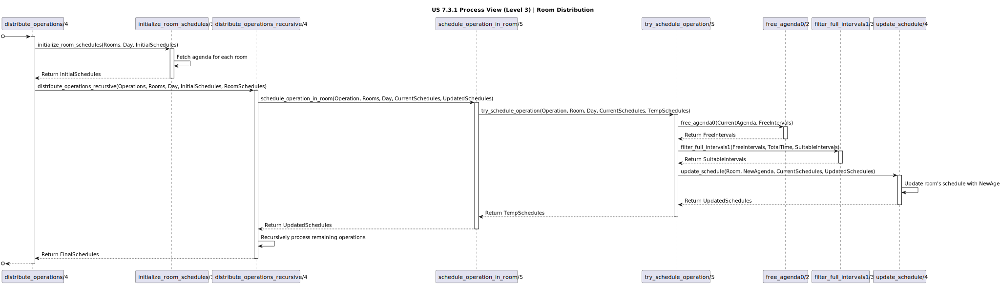

# US 7.3.1

<!-- TOC -->
* [US 7.3.1](#us-731)
  * [1. Context](#1-context)
  * [2. Requirements](#2-requirements)
  * [3. Analysis](#3-analysis)
    * [Domain Model](#domain-model)
  * [4. Design](#4-design)
    * [4.1. Realization](#41-realization)
    * [Process View](#process-view)
      * [Level 1](#level-1)
      * [Level 2](#level-2)
      * [Level 3](#level-3)
      * [4.1.3 Development View](#413-development-view)
      * [4.1.4 Physical View](#414-physical-view)
    * [4.2. Tests](#42-tests)
  * [5. Implementation](#5-implementation)
  * [6. Integration/Demonstration](#6-integrationdemonstration)
  * [7. Observations](#7-observations)
<!-- TOC -->

## 1. Context

* This is the first time this user story is being requested.

## 2. Requirements

**US 7.3.1:** As an Admin, I want an automatic method to assign a set of operations (surgeries) to several operation rooms
(assign is just to decide in which operation room the surgery will be done)

**Acceptance Criteria:**

- **7.3.1.1.** Operations must be assigned to multiple rooms based on: balanced occupancy across rooms, optimal utilization
of staff availability and consideration of staff involvement in other rooms to minimize idle time between surgeries.

- **7.3.1.2.** The assignment method should allow flexibility for emergency operations by leaving rooms underutilized if needed.

- **7.3.1.3.** This User Story will have to send an error message in case an exception is found regarding any of it's variables.

**Dependencies/References:**

**US 5.1.16 && 6.1.14:** Creates operation requests that will be used in this US.

**US 7.2.10:** Creates operation rooms that will be used in this US.

**US 7.3.1:** Creates operation rooms that will be used in this US.

**Client Clarifications:**

> **Question:** When reading the US 7.3.1 "As an Admin, I want an automatic method to assign a set of operations to several
> operation rooms" i was confused if, by chance, it is the same thing asked in US 7.3.2 but said in a more general way.
> 
> The understanding i got is: in US 7.3.1 a set of operations waiting to be scheduled are distributed over several rooms
> and only after that the scheduling is actually done in US 7.3.2. Is that correct? If yes, I suppose the distribution
> criterion is to balance the occupancy rate across the rooms.
>
> **Answer:** In Sprint2 we considered the scheduling of 1 day and 1 operations' room.
>
> Now in sprint 3 we will consider scheduling more operations' rooms.
>
> Let us suppose we have 3 operations' rooms and 36 operations to schedule.
>
> There are different possibilities to schedule.
>
> One that is very simple is to sort operations by time (preparation+surgery+cleaning) and start to assign the first 
> operation to room1, the second to room2, the third to room3, the fourth to room1, the fifth to room2, the sixth to 
> room3, the seventh to room1,.....the thirty-sixth to room3. This will give a balanced assignment of operations 
> (12 operations in each room). After that you call the Genetic Algorithm (GA) for room1, then the GA for room2, and 
> finally the GA for room3. Notice that things will work better for room1 and worst to room3, since when you call the 
> GA for room2 some staff members has their agenda more busy due to the scheduling of staff involved in room1, for room3 is 
> still more complicated. But if it works it's well!.
>
> Note1: it is good that staff is involved in several rooms. Notice that after a surgery the doctor will wait the 
> cleaning time and the preparation time before entering another surgery, but if the surgery is in another room we 
> can reduce this time. So in the assignment of operations to rooms you may consider that "assign to the room in which 
> the staff is less involved".
>
> Note 2: depending on the number of operations the balancing may not be adequate. For example, if we just have 8 
> surgeries maybe 1 room will be sufficient, and the others are free for some urgency that appears.
>
> Note 3: considering your complexity study of sprint2 notice that for reduced dimensions the "generate all and select 
> the best" is feasible while for other dimensions it is not possible to go in this wy and the GA is adequate, even 
> without the guarantee to generate the best.
>
> Finally, suggestion of approach for 7.3.1+7.3.2:
> - start with 7.3.2 (understand the given GA; improve according the required in the ALGAV TP even for the problem of 
> minimizing the tardiness in a manufacturing machine; then adapt for your problem still considering 1 room)
> - start 7.3.1 with the operations' assignment method and then change the GA adapted for your problem to ensure N rooms

> **Question:** This user story is only to decide where the surgery is going to take place, for what i understand.
My question is, if we need to check if the surgery is possible to be done in a certain room(if theres an availabity slot big enougth for the time needed for the surgery).
Or if there are for example 30 surgeries for a room, and does that room have enough availability slots for all of the 30 surgeries.
>
> **Answer:** You can check the relation between the sum of the operations times (preparation+surgery+cleaning) for a certain room and the sum of free times of the room. If you divide the first by the second (ratio) it is obvious that if the value is >1 it will be impossible.
But due to small time intervals tha are not occupied we sugest that the ratio has the value <0.8.
So, a check you can do during the assignment of operatios to rooms is to verify if the ratio is still in the limit.

## 3. Analysis

This user story focuses on distributing a set of surgeries across multiple operation rooms before scheduling. The main 
objective is to balance room occupancy while optimizing staff involvement and minimizing idle time. Surgeries can be 
initially sorted by their duration and distributed to rooms in a manner that ensures efficient utilization of resources.

To optimize, we will change the Genetic Algorithms (GA), which will allow to have in mind the overlapping staff schedules
and emergency accommodations.

### Domain Model

## 4. Design

### 4.1. Realization

The logical, physical, development and scenario views diagrams are generic for all the use cases of the backoffice component.
These diagrams can be found in the [generic views diagrams compilation file](../team-decisions/views/general-views.md).

The process view levels are here presented as they represent a process specific to each user story.

### Process View

#### Level 1

#### Level 2

As this level does not add any additional information regarding the user story's execution flow from level 1's diagram, 
it's diagram was deemed irrelevant.

#### Level 3

- _Visualization_

- _MDBackoffice_

- _Planning_

#### 4.1.3 Development View

The diagrams can be found in the [team decision views folder](../team-decisions/views/general-views.md#3-development-view).

#### 4.1.4 Physical View

The diagrams can be found in the [team decision views folder](../team-decisions/views/general-views.md#4-physical-view).

### 4.2. Tests

_// To do //_

## 5. Implementation

> TBD

## 6. Integration/Demonstration

> TBD

## 7. Observations
