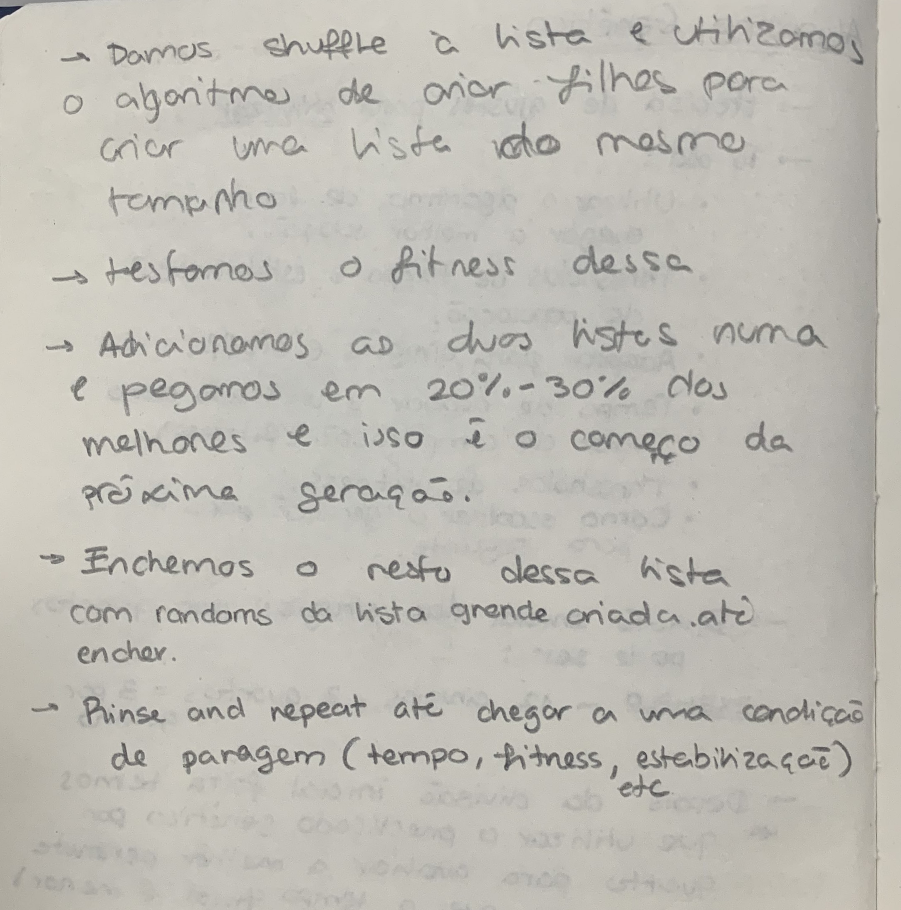

# US 7.3.2

<!-- TOC -->
- [US 7.3.2](#us-732)
  - [1. Context](#1-context)
  - [2. Requirements](#2-requirements)
  - [3. Analysis](#3-analysis)
  - [4. Design](#4-design)
    - [4.1. Realization](#41-realization)
  - [5. Implementation](#5-implementation)
  - [6. Testing](#6-testing)
<!-- TOC -->

## 1. Context

This is the first time this US is being worked on.
It relates to the Admin.

## 2. Requirements

**US 7.3.2:** As an Admin, I want to be able to schedule surgeries to several operations rooms using Genetic Algorithms (Genetic Algorithm parameters need to be tuned according to conditions like number of genes, desired time for solution, etc.)

**Acceptance Criteria:**

**US 7.3.2.1:** The scheduling process must use a Genetic Algorithm (GA) that supports parameter customization, including: **Number of Genes, Mutation Rate, Crossover Rate, Population Size.**

**US 7.3.2.2:** This User Story will require a User Interface done in Angular, following the methods done already in past USs like 6.3.1 or 6.3.2.

**US 7.3.2.3:** This User Story will require a back-end implementation done in .NET, following the methods done already in past USs like 6.3.1 or 6.3.2.

**US 7.3.2.4:** This User Story will have to send an error message in case an exception is found regarding any of it's variables.

**Dependencies/References:**

**US 7.1.1-5:** As it pertains to USs with the purpose of helping integration between modules, in this case, making them essential.

**US 7.2.8:** Is referenced as being another path to schedule the agendas.

**US 7.2.9:** Is referenced as being another path to schedule the agendas.

**US 7.2.10-11:** Creates more rooms/specializations that will be used in this US.

**Client Clarifications:**

>**Question:** None yet.
>
>**Answer:** None yet.

## 3. Analysis

This User Story asks that we implement yet another method of scheduling multiple surgeries to multiple rooms, however it specifies that we should use a **genetic algorithm** in **PROLOG**, such types of algorithms are used for solving both constrained and unconstrained optimization problems that is based on natural selection.

It should take into consideration:

1. Number of generations
2. Mutation rate
3. Crossover rate
4. Population size

## 4. Design

### 4.1. Realization

## 5. Implementation

//TO BE DONE

## 6. Testing

//TO BE DONE