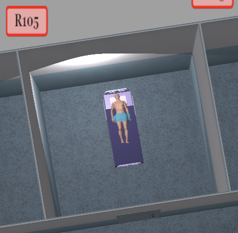

# US 7.5.4

<!-- TOC -->
- [US 7.5.4](#us-754)
  - [1. Context](#1-context)
  - [2. Requirements](#2-requirements)
  - [3. Analysis](#3-analysis)
  - [4. Design](#4-design)
    - [4.1. Realization](#41-realization)
      - [Views](#views)
    - [4.2. Domain Model Excerpt](#42-domain-model-excerpt)
    - [4.3. Applied Patterns](#43-applied-patterns)
  - [5. Implementation](#5-implementation)
  - [6. Testing](#6-testing)
<!-- TOC -->

## 1. Context

This user story is being implemented for the first time.

## 2. Requirements

**US 7.5.4:** As a healthcare staff member, whenever I select a different room, I want the camera (and the spotlight, if applicable) to move smoothly instead of instantly. The animation can either be created or defined using some API, such as tween.js.

**Acceptance Criteria:**

- 7.5.4.1: //todo 

**Dependencies/References:**

This user story depends on [7.5.1](../1220683/us-7.5.1/readme.md), as that user story is responsible for implementing the selection of the room feature.

## 3. Analysis

In order to accomplish this user story we will use Tween.js to configure the animation so that the camera moves smoothly upon a room selection.

Useful links: [Tween.js User Guide](https://tweenjs.github.io/tween.js/docs/user_guide.html), [Tween.js Github](https://github.com/tweenjs/tween.js) and [Wooden Door Project](https://moodle.isep.ipp.pt/mod/resource/view.php?id=212450).

## 4. Design

### 4.1. Realization

The design section for the smooth camera and spotlight transition begins with defining the core functionality: when a **user selects a different room, the camera and spotlight should move to predefined positions and orientations smoothly, rather than instantly.**

The implementation involves **setting up an animation system**, such as using tween.js, to **interpolate** both the camera's position and rotation, as well as the spotlight's position if applicable. **Each room will have predefined coordinates and settings for the camera and spotlight.**

When the user selects a room, this triggers the animation process, ensuring the transition feels natural and immersive. The transition duration, easing functions, and the synchronization between the camera and spotlight movement are crucial for creating a polished effect. The animation system will be integrated into the render loop to update continuously until the transition is complete, at which point the camera and spotlight will settle into their final positions for the selected room.

## 5. Implementation

Implementation was done following the design choices, each room had a spotlight, that spotlight was activated each time a person choose a room and was also deactivated everytime a person clicked on anything else:

## 6. Testing

//TO BE DONE